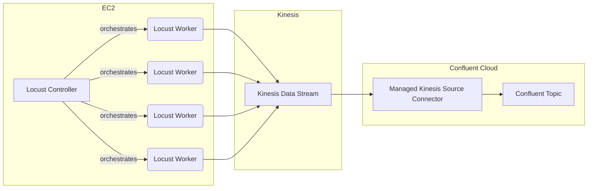

# benchmark-kinesis-connector

This project was used to demonstrate throughput capabilities in the Confluent Managed Source Connector for AWS Kinesis.

It uses the [Locust framework](https://locust.io/) to ramp traffic to Kinesis.

## Requirements

* [Locust Framework](https://locust.io/)
* [Terraform](https://terraform.io)
* [Confluent Cloud](https://confluent.cloud)